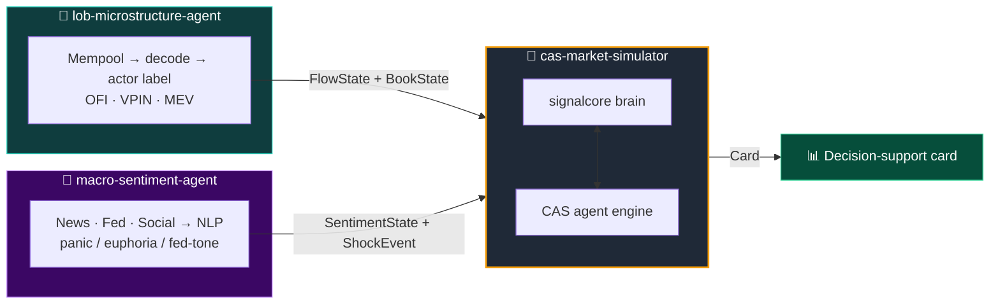
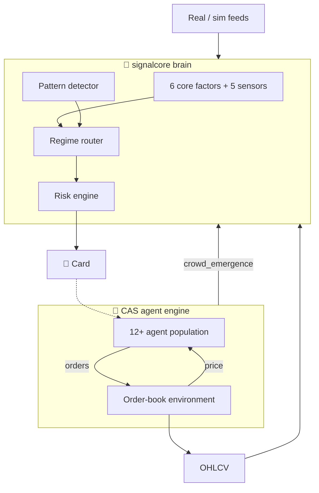

<div align="center">

# 🧠 cas-market-simulator

**A market simulator built on Complex Adaptive Systems (CAS)**
_Signal brain + multi-agent ecosystem — sealed with an honesty layer._

🌐 [Türkçe](README.md) · **English**

<br/>


</div>

---

> ⚠️ **Research / PoC — not investment advice.** Simulation outputs are for *observing emergent behavior*; they are not predictions.

---

## 🎯 What does it do?

Markets are the collective result of many simple actors that watch and react to one another. This repo models that system in two layers:

| Layer | Role | Question it asks |
|:--|:--|:--|
| 🧩 **`signalcore`** | Signal brain — indicators + patterns + regime + risk | *"What is being detected right now?*" |
| 🐜 **CAS Engine** | Multi-agent ecosystem — momentum, MM, panic, liquidation... | *"What do these actors give rise to together?*" |

These two layers form a **closed loop**: the collective behavior produced by the agent population is fed back into the brain as a factor.

---

## 🌐 The Big Picture

This simulator is the **hub** where three independent repos meet. The other two are "sensory organs"; the simulator reads them only through data contracts:



---

## 🏗️ Internal Architecture



---

## 🛡️ Honesty Layer

The most dangerous thing about a simulator is that it can fool itself. Every signal produced is tested against overfitting and luck:

- **CPCV** — Combinatorial Purged Cross-Validation
- **Deflated Sharpe** — multiple-testing penalty
- **Tail risk** — VaR / CVaR / Hill/EVT
- **Calibration** — stylized facts
- **HRP** — Hierarchical Risk Parity portfolio allocation

---

## 🚀 Running

### Backend

```bash
pip install -r requirements.txt
pytest -q                                   # 334 tests

# Dashboard API
python -m uvicorn cas_market_simulator.api.main:app --host 127.0.0.1 --port 8000

# Demos
PYTHONPATH=. python scripts/run_faz3_demo.py
PYTHONPATH=. python scripts/run_faz6_demo.py
PYTHONPATH=. python scripts/run_faz7_demo.py
PYTHONPATH=. python scripts/run_faz8_demo.py
PYTHONPATH=. python scripts/run_faz9_demo.py
```

### Frontend

```bash
cd ui
npm install
npm run dev        # http://localhost:5173
npm run test       # UI tests
npm run build      # production build -> ui/dist
```

The Vite dev server automatically proxies `/v1` requests to `http://127.0.0.1:8000`. For real backend data, run `VITE_USE_MOCK=false npm run dev`.

The entire core is **pure Python + NumPy**. Feeds run in deterministic simulation mode by default.

---

## ⚖️ Disclaimer & License

For research and educational purposes only. **Not investment advice.**

MIT — see [LICENSE](LICENSE).
