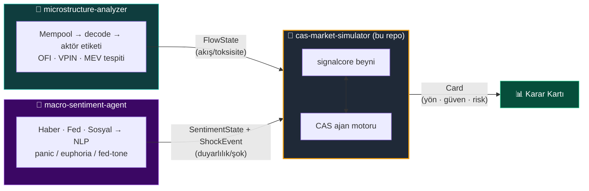
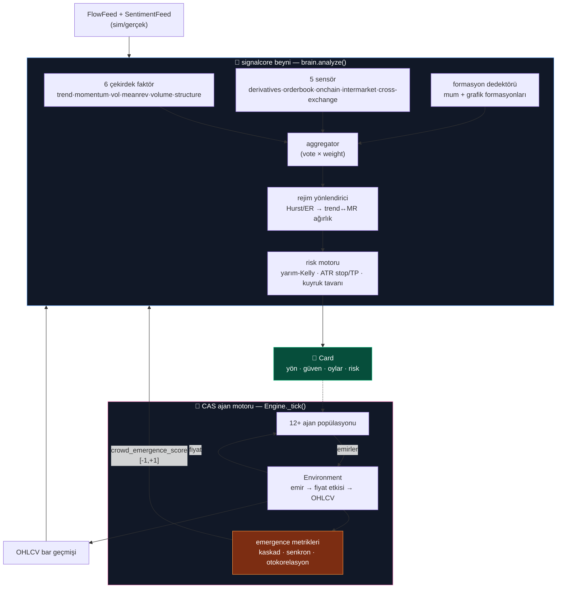
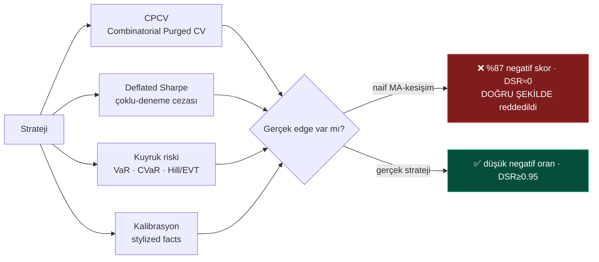

<div align="center">

# 🧠 cas-market-simulator

**Karmaşık Uyarlanabilir Sistem (CAS) tabanlı piyasa simülatörü**
_İki katman: sinyal beyni (`signalcore`) + çok-ajanlı piyasa ekosistemi — bir dürüstlük katmanıyla mühürlenmiş._

<br/>


</div>

---

> ⚠️ **Araştırma / PoC — yatırım tavsiyesi değildir.** Simülasyon ≠ kehanet.
> Amaç bir "alfa" iddiası değil; basit kuralların çarpışmasından **ortaya çıkan
> (emergent)** davranışı ölçülebilir ve dürüst biçimde gözlemlemektir.

---

## 🎯 Ne işe yarar?

Piyasalar birbirini gözleyen, birbirine tepki veren binlerce basit aktörün
kolektif sonucudur — yani klasik bir **karmaşık uyarlanabilir sistem**. Bu repo
o sistemi iki katmanda modeller:

| Katman | Rol | Sorduğu soru |
|:--|:--|:--|
| 🧩 **`signalcore`** | Sinyal beyni — indikatör + formasyon + rejim + risk | *"Şu an ne alınmalı/satılmalı?"* |
| 🐜 **CAS Motoru** | Çok-ajanlı ekosistem — momentum, balina, likidasyon, panik… | *"Bu aktörler bir arada neyi doğurur?"* |

Bu iki katman **kapalı bir döngüdür**: ajan popülasyonunun ürettiği kolektif
davranış (`crowd_emergence`) beyne bir faktör olarak geri beslenir — beyin
kalabalığı okur, kalabalık fiyatı hareket ettirir, fiyat beyni besler.

---

## 🌐 Büyük resim — hibrit CAS ekosistemi

Bu simülatör üç bağımsız reponun buluştuğu **merkezdir**. Diğer ikisi birer
"duyu organı"; simülatör bunları yalnızca **veri sözleşmeleri** üzerinden okur
(kod bağımlılığı yok).



| Repo | Üretir | Sözleşme tipi |
|:--|:--|:--|
| 🔬 [`microstructure-analyzer`](../microstructure-analyzer) | DEX akış mikroyapısı, MEV, aktör karışımı | `FlowState` |
| 📰 [`macro-sentiment-agent`](../macro-sentiment-agent) | Haber/Fed/sosyal duyarlılık + dışsal şok | `SentimentState`, `ShockEvent` |
| 🧠 **cas-market-simulator** | Sinyal beyni + ajan ekosistemi + dürüstlük | `FactorVote`, `PatternHit`, `Card` |

> Tüm tipler `cas_market_simulator/adapters/contracts.py` içinde `Protocol`
> olarak sabittir. Her bileşen kendi reposunda gelişir; buluşma noktası yalnızca
> bu sözleşmedir (gevşek bağlılık).

---

## 🏗️ İç mimari — iki katmanlı kapalı döngü



**Geri besleme döngüsü (Faz 7):** her tick'te son 60 tick'ten
`crowd_emergence_score` hesaplanır → beyne düşük ağırlıklı bir faktör olarak
girer → beyin kararı ajanları etkiler → ajanlar fiyatı hareket ettirir → döngü
kapanır.

---

## 🐜 Ajan ekosistemi

Her ajan **tek kural, ~50–90 satır**. Zenginlik kuralların basitliğinden değil,
etkileşimlerinden doğar.

| Ajan | Davranışı | Rolü |
|:--|:--|:--|
| `MomentumAgent` | Yükseliyorsa al | Trend / balon büyütücü |
| `MarketMakerAgent` | İki yönlü kotasyon; vol artınca çekil | Likidite / denge |
| `PanicAgent` | Doğrulanmış düşüşte gecikmeli sat | Aşağı kaskad tetikleyici |
| `LiquidationEngineAgent` | Kaldıraçlı havuz; eşik kırılınca zorunlu kapat | 💥 **Kaskadın yıldızı** |
| `WhaleAgent` | Büyük, seyrek, yön belirleyici emirler | Şok kaynağı |
| `ArbitrageAgent` | Referans fiyata yakınsa | Ortalama-döndürücü |
| `MevAgent` | Kısa-vade momentumu büyüt (sandwich analogu) | Mikro-yağmacı |
| `NewsReactorAgent` | `ShockEvent`'e tepki + üssel sönüm | Makro köprüsü |
| `ContrarianAgent` | Aşırı uzamada ters pozisyon | Denge / fitil |
| `AdaptiveAgent` | Zarar edince parametre mutasyonu | 🧬 Tek-ajan evrimi |
| `RegimeSwitcherAgent` | Verimlilik oranıyla trend↔MR geçişi | Uyarlanma |
| `HerdAgent` | En kârlı ajanı taklit et | 🐑 Sürü / balon |

---

## 🛡️ Dürüstlük katmanı (Faz 9)

Bir simülatörün en tehlikeli yanı kendini kandırabilmesidir. Bu katman, üretilen
her sinyali **aşırı-uyum ve şansa karşı** sınar:



Demo'daki naif strateji bilerek zayıftır — **katmanın çalıştığını kanıtlamak
için**. `portfolio.py` ayrıca scipy'siz sıfırdan **HRP** (Hierarchical Risk
Parity) + korelasyon limiti + günlük risk bütçesi ölçeklendirmesi sağlar.

---

## 🗺️ Yol haritası — Faz 0 → 9

| Faz | Başlık | Öne çıkan | Test |
|:--:|:--|:--|:--:|
| 0️⃣ | İskelet | Uçtan uca boru hattı bağlı | ✅ |
| 1️⃣ | Beyin | 6 faktör + rejim + risk + doğrulama | ✅ |
| 2️⃣ | Formasyoncu | Mum + grafik formasyonları | ✅ |
| 3️⃣ | Omurga | Gerçek `SignalCoreFactorBrain` + paper exec + journal | ✅ |
| 4️⃣ | Sensörler | 5 yeni düşük-ağırlıklı sensör | ✅ |
| 5️⃣ | CAS başlıyor | Momentum / MM / panik ajanları | ✅ |
| 6️⃣ | Kaskad | +6 ajan + şok → **ölçülen −%23 kaskad** | ✅ |
| 7️⃣ | Kapalı döngü | `crowd_emergence` beyne geri besleniyor | ✅ |
| 8️⃣ | Meta ajanlar | Evrim + rejim geçişi + sürü | ✅ |
| 9️⃣ | Dürüstlük | Kalibrasyon · CPCV · DSR · kuyruk · HRP | ✅ **314/314** |

**Faz 6 vaka çalışması:** tick 100'de scriptli panik şoku → 20 tick'te **−%23
kaskad**, 26 pozisyon likide, ajan senkronizasyonu **0.82**, getiri
otokorelasyonu **+0.78**. Neden izlenebilir: şok → panik/likidasyon → fiyat
çöküşü.

---

## 🚀 Çalıştırma

```bash
pip install -r requirements.txt
pytest -q                                   # 314 test, tamamı yeşil

# Demolar (her biri kendi fazını gösterir):
PYTHONPATH=. python3 scripts/run_faz3_demo.py   # beyin + sim feed + forward-test
PYTHONPATH=. python3 scripts/run_faz6_demo.py   # 9 ajan + panik şoku → kaskad
PYTHONPATH=. python3 scripts/run_faz7_demo.py   # crowd_emergence kartta faktör
PYTHONPATH=. python3 scripts/run_faz8_demo.py   # meta ajanlar → popülasyon kayması
PYTHONPATH=. python3 scripts/run_faz9_demo.py   # dürüstlük katmanı + HRP
```

Tüm çekirdek **saf Python + NumPy** — scipy/sklearn/torch yok, harici API/anahtar
gerekmez. Feed'ler varsayılan olarak deterministik **simülasyon modunda** çalışır.

---

## 📁 Proje yapısı

```
cas_market_simulator/
  adapters/     contracts.py (sözleşme + Protocol'ler) · bars · sentiment/flow feed · factor_brain
  environment/  emir → fiyat etkisi → tick (+ dışsal şok enjeksiyonu)
  agents/       12+ ajan (taban sınıf otomatik PnL takibi yapar)
  analysis/     execution (paper) · journal (forward-test) · emergence · portfolio (HRP)
  engine/       senkron tick döngüsü — beyin + ajanlar + şok + geri besleme
signalcore/
  indicators/   6 çekirdek faktör + 5 sensör (her biri saf: bars → FactorVote)
  patterns/     mum + grafik formasyonları + destek/direnç
  combine/      aggregator · regime_router · registry
  risk/         sizing (yarım-Kelly) · levels (ATR) · tail (VaR/CVaR/Hill/EVT)
  validation/   walkforward · leakage · conformal · calibration · cpcv · deflated_sharpe
  brain.py      analyze(symbol, bars, extra_factors, sensor_states) → Card
```

---

## 🔌 Entegrasyon durumu ve sonraki adım

Bu repo ilk kez, diğer iki reponun **gerçek** kodunun yanında bulunuyor.
Şu an `adapters/sentiment_feed.py` ve `flow_feed.py` içindeki `Sim*Feed`
sınıfları deterministik **yer tutuculardır** — aynı `Protocol`'ü uygulayan ama
gerçek repoları sarmayan sentetik süreçler.

**Sıradaki iş:** bu iki sınıfı, üstteki repoların hâlihazırda offline çalışan
gerçek `FlowFeed` / `SentimentFeed` beslemelerine bağlamak. Sözleşme
(`contracts.py`) sabit kalacak şekilde tasarlandığı için çekirdek mantığa
dokunmak gerekmez. Detaylı yön için: [`PLAN.md`](PLAN.md), [`FAZ-PLANI.md`](FAZ-PLANI.md).

---

## ⚖️ Uyarı & Lisans

Yalnızca araştırma ve eğitim amaçlıdır. **Yatırım tavsiyesi değildir.** Kripto
ticareti önemli risk taşır; yazarlar hiçbir kayıptan sorumlu değildir.

MIT — bkz. [LICENSE](LICENSE).
