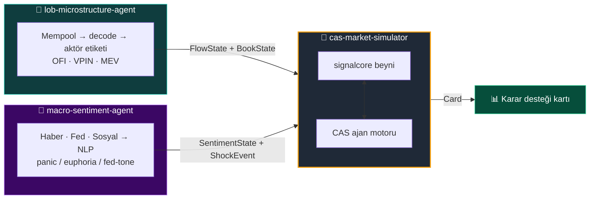
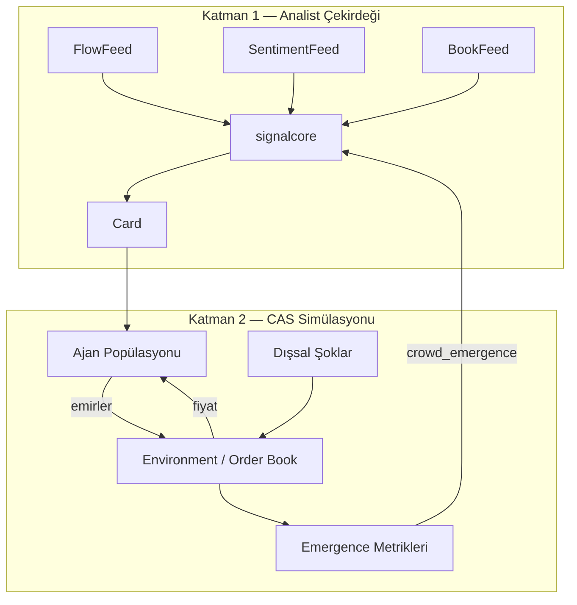
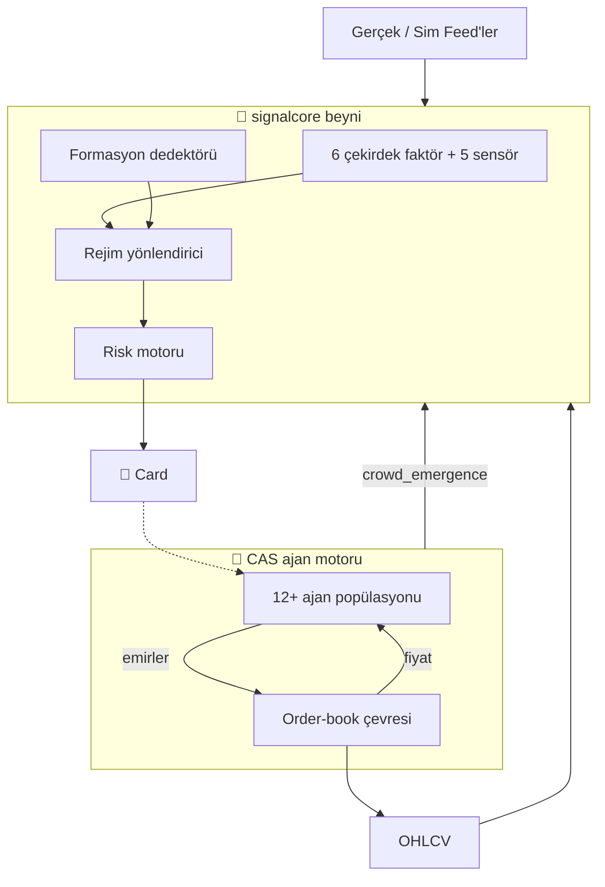
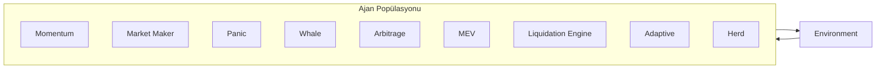

<div align="center">

# 🧠 cas-market-simulator

**Karmaşık Uyarlanabilir Sistem (CAS) tabanlı piyasa simülatörü**  
_Sinyal beyni + çok-ajanlı ekosistem — dürüstlük katmanıyla mühürlenmiş._

🌐 **Türkçe** · [English](README.en.md)

<br/>


</div>

---

> ⚠️ **Araştırma / PoC — yatırım tavsiyesi değildir.**  
> Simülasyon çıktıları *ortaya çıkan davranışların gözlemlenmesi* içindir; kehanet değildir.

---

## 📌 İçindekiler

- [Proje Özeti](#-proje-özeti)
- [Büyük Resim](#-büyük-resim)
- [İç Mimari](#-iç-mimari)
- [Başlıca Özellikler](#-başlıca-özellikler)
- [Hızlı Başlangıç](#-hızlı-başlangıç)
- [Modül / Katman Rehberi](#-modül--katman-rehberi)
- [Ajanlar](#-ajanlar)
- [Veri Sözleşmeleri](#-veri-sözleşmeleri)
- [Dürüstlük Katmanı](#-dürüstlük-katmanı)
- [Dashboard ve UI](#-dashboard-ve-ui)
- [Testler](#-testler)
- [Sözlük](#-sözlük)
- [Sorumluluk Reddi ve Lisans](#-sorumluluk-reddi-ve-lisans)

---

## 🎯 Proje Özeti

Piyasalar, birbirini gözleyen ve tepki veren çok sayıda basit aktörün kolektif sonucudur. `cas-market-simulator`, bu sistemi iki katmanda modeller:

| Katman | Rol | Sorduğu Soru |
|---|---|---|
| 🧩 **`signalcore`** | Sinyal beyni — indikatör + formasyon + rejim + risk | *"Şu an ne algılanıyor?"* |
| 🐜 **CAS Motoru** | Çok-ajanlı ekosistem — momentum, MM, panik, likidasyon... | *"Bu aktörler bir arada neyi doğurur?"* |

Bu iki katman **kapalı bir döngüdür**: ajan popülasyonunun ürettiği kolektif davranış, beyne bir faktör olarak geri beslenir. Böylece sadece teknik faktörler değil, **kalabalığın emergent davranışı** da analiz kartına yansır.

> Amaç "şimdi al/sat" demek değil; **"şu koşullarda şu kaskad beliriyor"** gözlemleri yapmaktır.

---

## 🌐 Büyük Resim

Bu simülatör, üç bağımsız reponun buluştuğu **merkezdir**. Diğer ikisi birer "duyu organı"; simülatör bunları yalnızca veri sözleşmeleri üzerinden okur:



### Hibrit Tasarım

Sistem iki katmanlı bir hibrittir:

- **Katman 1 — Analist Çekirdeği:** `signalcore`, diğer iki repo'nun sinyallerini de okuyarak zenginleştirilmiş bir analiz kartı üretir.
- **Katman 2 — CAS Simülasyonu:** Heterojen ajan popülasyonu, dışsal şoklar ve emir defteri çevresiyle kolektif davranışları gözlemler.



---

## 🏗️ İç Mimari



### Veri Akışı

1. **Feed'ler** (gerçek veya simülasyon) `signalcore`'a OHLCV ve sensör verisi sağlar.
2. **signalcore**, 6 çekirdek faktör + 5 sensör + formasyonları birleştirir.
3. **Rejim yönlendirici**, trend / mean-reversion ağırlıklarını ayarlar.
4. **Risk motoru**, stop/tp/pozisyon büyüklüğü üretir.
5. **Card** üretilir ve CAS ajanlarına gösterilir.
6. **Ajanlar** kartı + kendi kurallarına göre emir verir.
7. **Environment** emirleri eşleştirir, yeni fiyat oluşturur.
8. **Emergence metrikleri** hesaplanır ve tekrar signalcore'a geri beslenir.

---

## 📦 Başlıca Özellikler

| Alan | Özellik | Açıklama |
|---|---|---|
| 🧠 **signalcore** | 6 çekirdek faktör | trend, momentum, volatility, meanrev, volume, structure |
| 📡 **Sensörler** | 5 harici sensör | derivatives, orderbook, onchain, intermarket, cross_exchange |
| 📈 **Formasyonlar** | Mum + grafik | engulfing, hammer, double top, triangle, OBO, bayrak/flama |
| 🎚️ **Rejim Router** | Trend ↔ MR | Hurst/ER ile rejim tespiti; RANDOM rejimde güven kısılır |
| 🛡️ **Risk Motoru** | Kelly + ATR | Yarım-Kelly boyutlandırma, ATR stop/tp, kuyruk riski |
| 🐜 **CAS Motoru** | 12+ ajan | momentum, market-maker, panik, whale, MEV, arbitraj, likidasyon, adaptive, herd |
| 📖 **Order Book** | Fiyat-zaman öncelikli | Limit/market eşleşme, VWAP fiyatlandırma, flash crash mekaniği |
| ⚡ **Şok Enjeksiyonu** | Dışsal olaylar | Panik, öfori, Fed tonu gibi şokları çevreye enjekte et |
| 🔄 **Geri Besleme** | crowd_emergence | Simülasyon çıktısı signalcore faktörüne dönüşür |
| 🖥️ **Dashboard** | React + FastAPI | Gerçek zamanlı kart, mikroyapı, sentiment, CAS lab |
| 🧪 **Doğrulama** | CPCV + DSR | Aşırı uyum ve şans kontrolü |

---

## 🚀 Hızlı Başlangıç

### Backend

```bash
# Repoyu klonla
git clone https://github.com/7mertyavuz/cas-market-simulator.git
cd cas-market-simulator

# Bağımlılıkları kur
pip install -r requirements.txt

# Testleri çalıştır
pytest -q                                   # 334 test

# Dashboard API
python -m uvicorn cas_market_simulator.api.main:app --host 127.0.0.1 --port 8000

# Demolar
PYTHONPATH=. python scripts/run_signalcore_demo.py
PYTHONPATH=. python scripts/run_signalcore_brain_demo.py
PYTHONPATH=. python scripts/run_faz3_demo.py
PYTHONPATH=. python scripts/run_faz5_demo.py
PYTHONPATH=. python scripts/run_faz6_demo.py
PYTHONPATH=. python scripts/run_faz7_demo.py
PYTHONPATH=. python scripts/run_faz8_demo.py
PYTHONPATH=. python scripts/run_faz9_demo.py
```

### Frontend

```bash
cd ui
npm install
npm run dev        # http://localhost:5173
npm run test       # UI testleri
npm run build      # production build -> ui/dist
```

Vite geliştirme sunucusu `/v1` isteklerini otomatik olarak `http://127.0.0.1:8000`'e yönlendirir. Gerçek backend verisi için `VITE_USE_MOCK=false npm run dev` çalıştırın.

---

## 📚 Modül / Katman Rehberi

### `signalcore/` — Sinyal Beyni

| Modül | Görev |
|---|---|
| `core/types.py` | `OHLCVBar`, `FactorVote`, `PatternHit`, `Card` veri tipleri |
| `core/registry.py` | Faktör kayıt defteri |
| `core/ohlcv.py` | Bar doğrulama ve dönüşüm |
| `feeds.py` | Sentetik OHLCV üreteci (rejim-anahtarlamalı GBM) |
| `brain.py` | `analyze(symbol, bars, extra_factors) -> Card` |
| `indicators/trend.py` | EMA, Supertrend, ADX |
| `indicators/momentum.py` | RSI, MACD, Connors RSI |
| `indicators/volatility.py` | ATR, Squeeze |
| `indicators/meanrev.py` | Bollinger %B, z-score, OU-spread |
| `indicators/volume.py` | CMF, OBV, VWAP, hacim profili |
| `indicators/structure.py` | Hurst, Efficiency Ratio, fracdiff |
| `indicators/derivatives.py` | Funding, OI, basis, IV, put/call |
| `indicators/orderbook.py` | CEX derinlik, spread, likidasyon haritası |
| `indicators/onchain.py` | Borsa netflow, stablecoin, aktif adres, NVT |
| `indicators/intermarket.py` | DXY, altın, 10Y, S&P |
| `indicators/cross_exchange.py` | Borsalar arası fark, coinbase premium |
| `indicators/sensors.py` | 5 sensörü tek yerden birleştirir |
| `patterns/candles.py` | Mum formasyonları |
| `patterns/chart.py` | Grafik formasyonları |
| `patterns/levels.py` | Destek/direnç, pivot, likidite seviyeleri |
| `patterns/detector.py` | Formasyon tarama ve oy dönüşümü |
| `combine/aggregator.py` | Oy × ağırlık → yön + güven |
| `combine/regime_router.py` | Trend / MR / RANDOM rejim yönlendirmesi |
| `risk/sizing.py` | Edge / yarım-Kelly boyutlandırma |
| `risk/levels.py` | ATR stop/tp/geçersizlik |
| `risk/tail.py` | CVaR / EVT kuyruk riski |
| `validation/cpcv.py` | Combinatorial Purged Cross-Validation |
| `validation/deflated_sharpe.py` | Çoklu deneme cezalı Sharpe |
| `validation/factor_tracker.py` | Faktör katkı takibi |
| `validation/leakage.py` | Bar-içi sızıntı testi |
| `validation/conformal.py` | Konformal belirsizlik |
| `validation/walkforward.py` | Walk-forward doğrulama |

### `cas_market_simulator/adapters/` — Adaptörler

- **`contracts.py`**: CAS veri sözleşmeleri (`SentimentState`, `ShockEvent`, `FlowState`, `BookState`, `FactorVote`, `PatternHit`, `Card`).
- **`factor_brain.py`**: `signalcore.analyze`'ı saran `FactorBrain` adaptörü.
- **`flow_feed.py`**: `microstructure-analyzer.FlowFeed` adaptörü.
- **`book_feed.py`**: `microstructure-analyzer.BookFeed` adaptörü.
- **`sentiment_feed.py`**: `macro-sentiment-agent.SentimentFeed` adaptörü.
- **`bars.py`**: Environment geçmişinden OHLCV bar'ları türetir.

### `cas_market_simulator/environment/` — Çevre

- **`base.py`**: Basit fiyat süreci çevresi.
- **`orderbook.py`**: Fiyat-zaman öncelikli limit/market emir defteri.
- **`recorder.py`**: Defter ve fiyat geçmişi kaydedici.

### `cas_market_simulator/agents/` — Ajanlar

| Ajan | Davranışı |
|---|---|
| `momentum.py` | Trend yönüne pozisyon |
| `market_maker.py` | Spread koyar, toksik akışta çekilir |
| `panic.py` | Duyguyla geç tepki verir |
| `contrarian.py` | Aşırı uçlardan ters pozisyon |
| `whale.py` | Büyük, seyrek, etkili emirler |
| `arbitrage.py` | Fiyat farkını kapatır |
| `mev.py` | Diğer emirleri avlar |
| `liquidation_engine.py` | Kaldıraç eşiği kırılınca zorunlu satış |
| `news_reactor.py` | Şok olaylarına tepki verir |
| `adaptive.py` | Zarar edince stratejiyi mutasyona uğratır |
| `regime_switcher.py` | Volatilite rejimine göre momentum ↔ MR geçişi |
| `herd.py` | En kârlı ajanı taklit eder (sürü davranışı) |
| `base.py` | Ortak `Agent` arayüzü + PnL takibi |

### `cas_market_simulator/engine/` — Motor

- **`loop.py`**: Senkron tick döngüsü. Ajanları çalıştırır, şokları uygular, `Card` üretir, forward-test defterini yazar, crowd_emergence skorunu geri besler.

### `cas_market_simulator/analysis/` — Analiz

- **`emergence.py`**: Kaskad büyüklüğü, ajan senkronizasyonu, getiri otokorelasyonu, flash crash frekansı.
- **`execution.py`**: Paper emir yürütme.
- **`journal.py`**: Forward-test defteri ve sinyal etiketleme.
- **`portfolio.py`**: HRP portföy dağıtımı.

### `cas_market_simulator/api/` — API Cephesi

- **`main.py`**: FastAPI uygulaması. `/v1/card`, `/v1/flow`, `/v1/book`, `/v1/sentiment`, `/v1/shocks`, `/v1/sim/history`, `/v1/stream` WebSocket.

### `ui/` — React Dashboard

- React 19 + Vite + TypeScript + Tailwind CSS + Recharts.
- Ekranlar: Analist Kartı, Mikroyapı, Sentiment, CAS Lab, HITL, Kılavuz.

---

## 🤖 Ajanlar

CAS'ın en önemli kuralı: **ajanları basit tut**. Emergence, basit kuralların çarpışmasından doğar.



Her ajan yaklaşık şu yapıya sahiptir:

```python
class Agent:
    def observe(self, state): ...     # çevreyi gör
    def decide(self) -> Order | None: ...  # emir ver
    def on_fill(self, order, price): ...   # PnL güncelle
    def on_shock(self, shock, now): ...    # (opsiyonel) şoka tepki
```

---

## 🔗 Veri Sözleşmeleri

`cas-market-simulator`, diğer repo'lara dokunmadan sadece veri tipleri üzerinden bağlanır.

### `FlowState` (lob-microstructure-agent'dan)

| Alan | Anlamı |
|---|---|
| `flow_imbalance` | Net alış/satış baskısı |
| `vpin_toxicity` | Toksik akış |
| `whale_net_usd` | Balina net akışı |
| `actor_mix` | WHALE/MEV_BOT/RETAIL oranları |
| `direction_prob_up` | Kısa vadeli yukarı olasılık |
| `regime` | normal / toxic / highvol |

### `BookState` (lob-microstructure-agent'dan)

| Alan | Anlamı |
|---|---|
| `spread_bps` | En iyi alış-satış farkı |
| `microprice` | Derinlik-ağırlıklı adil fiyat |
| `depth_imbalance` | Çok seviyeli derinlik dengesizliği |
| `kyle_lambda` | Hacim başına fiyat etkisi |
| `iceberg_score` | Gizli likidite şüphesi |
| `spoof_score` | Yanıltıcı katmanlama şüphesi |

### `SentimentState` (macro-sentiment-agent'dan)

| Alan | Anlamı |
|---|---|
| `polarity` | Genel duyarlılık |
| `intensity` | Şiddet |
| `emotion` | fear / greed / uncertainty |
| `fed_tone` | hawkish (+1) / dovish (-1) |
| `source_breakdown` | Kaynak bazında polarite |

### `ShockEvent` (macro-sentiment-agent'dan)

| Alan | Anlamı |
|---|---|
| `kind` | panic / euphoria / fed_tone / narrative_shift |
| `magnitude` | Şok büyüklüğü |
| `decay_halflife_s` | Yarılanma süresi |

### `Card` (signalcore çıktısı)

| Alan | Anlamı |
|---|---|
| `direction` | LONG / SHORT / NEUTRAL |
| `confidence` | 0–1 güven |
| `votes` | Her faktörün oy ve ağırlığı |
| `patterns` | Tespit edilen formasyonlar |
| `risk` | size_pct, stop, tp, cvar |

---

## 🛡️ Dürüstlük Katmanı

Bir simülatörün en tehlikeli yanı kendini kandırabilmesidir. Üretilen her sinyal aşırı-uyum ve şansa karşı sınanır:

| Teknik | Amaç |
|---|---|
| **CPCV** | Combinatorial Purged Cross-Validation — zaman serisi ezberini önler |
| **Deflated Sharpe** | Çoklu deneme cezası — şans faktörünü kırar |
| **Leakage Test** | Bar-içi bilgi sızıntısını yakalar |
| **Conformal** | Tahmin belirsizliğini niceler |
| **Factor Tracker** | Yeni faktörün gerçek katkısını ölçmeden ağırlık artmaz |
| **Kalibrasyon** | Üretilen piyasa stilize gerçeklerle (fat tails, vol clustering) karşılaştırılır |
| **HRP** | Hierarchical Risk Parity portföy dağıtımı |

### Kritik Kural

> **Simülasyon ≠ kehanet.** Kalibre edilmeden ondan ticari karar üretilmez.

---

## 🖥️ Dashboard ve UI

CAS Market Dashboard, tüm sinyalleri tek ekranda birleştirir:

| Ekran | İçerik |
|---|---|
| **Analist Kartı** | Yön, güven, faktör oyları, formasyonlar, risk parametreleri |
| **Mikroyapı** | Flow imbalance, VPIN, actor mix, BookState |
| **Sentiment & Şoklar** | Panik/öfori/Fed tonu, aktif şoklar |
| **CAS Laboratuvarı** | Fiyat serisi, ajan PnL, crowd_emergence, kaskad replay |
| **HITL Onay** | Operatör müdahalesi ve not kaydı |

```bash
# Backend
cd /
python -m uvicorn cas_market_simulator.api.main:app --port 8000

# Frontend
cd ui
npm run dev
```

Tarayıcıda `http://localhost:5173` açın.

---

## ✅ Testler

```bash
pytest -q
```

334'ten fazla test şunları kapsar:

- signalcore faktör ve formasyon hesaplamaları
- Aggregator ve rejim yönlendirici
- Risk motoru ve kuyruk riski
- CPCV, Deflated Sharpe, leakage, conformal
- CAS ajan davranışları ve PnL takibi
- Engine end-to-end akışı
- Emir defteri eşleşme motoru
- Şok enjeksiyonu ve emergence metrikleri
- Adaptif ve sürü ajanları
- Adaptör sözleşmeleri
- API uç noktaları

UI testleri için:

```bash
cd ui
npm run test
```

---

## 📖 Sözlük

| Terim | Açıklama |
|---|---|
| **Absorption** | Piyasanın baskın agresif emri emmesi; fiyat beklenen yönde gitmez. |
| **Agent** | Belirli kurallara göre hareket eden otonom aktör. |
| **CAS** | Complex Adaptive System — karmaşık uyarlanabilir sistem. |
| **CPCV** | Combinatorial Purged Cross-Validation; zaman serisi için özel cross-validation. |
| **Crowd Emergence** | Ajan popülasyonunun kolektif olarak ürettiği davranış skoru. |
| **Deflated Sharpe** | Çoklu test cezası uygulanmış Sharpe oranı. |
| **Emergence** | Basit kuralların etkileşiminden doğan karmaşık, beklenmedik davranış. |
| **Environment** | Ajanların etkileştiği çevre / emir defteri. |
| **Flash Crash** | Kısa sürede derin fiyat düşüşü ve hızlı toparlanma. |
| **HRP** | Hierarchical Risk Parity; korelasyona dayalı portföy dağıtımı. |
| **Hurst** | Trend gücünü ölçen istatistik. |
| **JIT** | Just-In-Time liquidity; işlem öncesi eklenip hemen çekilen likidite. |
| **Mean Reversion** | Ortalama dönüşü davranışı. |
| **Meta-Labeling** | Yön modelinin ne zaman haklı olduğunu tahmin eden ikinci katman. |
| **OHLCV** | Open-High-Low-Close-Volume bar verisi. |
| **Order Book** | Alış/satış emirlerinin derinlik listesi. |
| **Paper Trading** | Gerçek para kullanmadan simüle edilmiş işlem. |
| **Regime** | Piyasanın trend, mean-reversion veya random davrandığı dönem. |
| **Spoofing** | Yanıltıcı emirlerle piyasa algısını değiştirme. |
| **VWAP** | Volume-Weighted Average Price; hacim ağırlıklı ortalama fiyat. |
| **Walk-Forward** | Gelecek veri kullanılmadan model performansını değerlendirme. |

---

## ⚖️ Sorumluluk Reddi ve Lisans

Sistem yalnızca araştırma ve eğitim amaçlıdır. **Yatırım tavsiyesi değildir.** Simülasyon çıktıları, gerçek piyasa davranışının yerini tutamaz.

**Lisans:** MIT — bkz. [LICENSE](LICENSE).

---

<div align="center">

**Built with signalcore + CAS Engine + React** · Deterministik · Emergence-aware · Research-first

</div>
