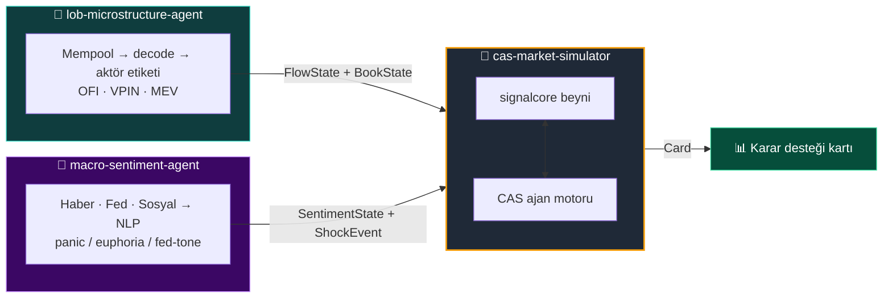
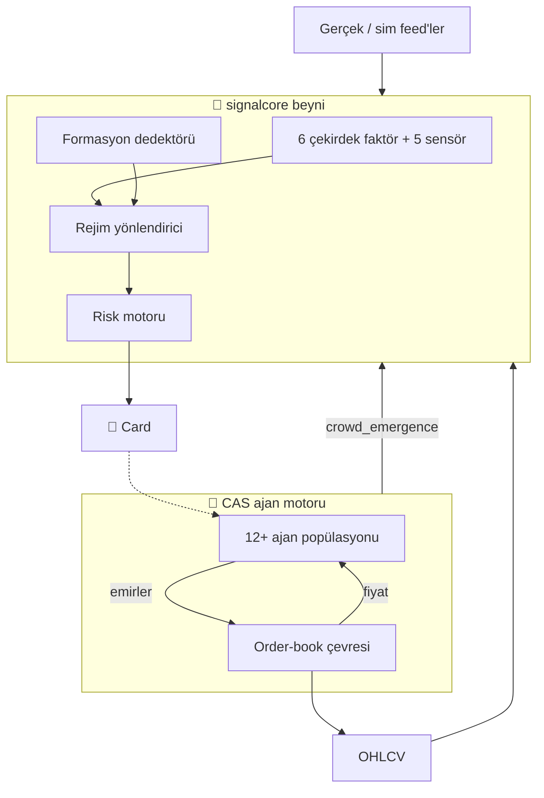

<div align="center">

# 🧠 cas-market-simulator

**Karmaşık Uyarlanabilir Sistem (CAS) tabanlı piyasa simülatörü**
_Sinyal beyni + çok-ajanlı ekosistem — dürüstlük katmanıyla mühürlenmiş._

<br/>


</div>

---

> ⚠️ **Araştırma / PoC — yatırım tavsiyesi değildir.** Simülasyon çıktıları *ortaya çıkan davranışların gözlemlenmesi* içindir; kehanet değildir.

---

## 🎯 Ne işe yarar?

Piyasalar, birbirini gözleyen ve tepki veren çok sayıda basit aktörün kolektif sonucudur. Bu repo bu sistemi iki katmanda modeller:

| Katman | Rol | Sorduğu soru |
|:--|:--|:--|
| 🧩 **`signalcore`** | Sinyal beyni — indikatör + formasyon + rejim + risk | *"Şu an ne algılanıyor?*" |
| 🐜 **CAS Motoru** | Çok-ajanlı ekosistem — momentum, MM, panik, likidasyon... | *"Bu aktörler bir arada neyi doğurur?*" |

Bu iki katman **kapalı bir döngüdür**: ajan popülasyonunun ürettiği kolektif davranış, beyne bir faktör olarak geri beslenir.

---

## 🌐 Büyük Resim

Bu simülatör, üç bağımsız reponun buluştuğu **merkezdir**. Diğer ikisi birer "duyu organı"; simülatör bunları yalnızca veri sözleşmeleri üzerinden okur:



---

## 🏗️ İç Mimari



---

## 🛡️ Dürüstlük Katmanı

Bir simülatörün en tehlikeli yanı kendini kandırabilmesidir. Üretilen her sinyal aşırı-uyum ve şansa karşı sınanır:

- **CPCV** — Combinatorial Purged Cross-Validation
- **Deflated Sharpe** — çoklu-deneme cezası
- **Kuyruk riski** — VaR / CVaR / Hill/EVT
- **Kalibrasyon** — stilize gerçekler
- **HRP** — Hierarchical Risk Parity portföy dağıtımı

---

## 🚀 Çalıştırma

### Backend

```bash
pip install -r requirements.txt
pytest -q                                   # 334 test

# Dashboard API
python -m uvicorn cas_market_simulator.api.main:app --host 127.0.0.1 --port 8000

# Demolar
PYTHONPATH=. python scripts/run_faz3_demo.py
PYTHONPATH=. python scripts/run_faz6_demo.py
PYTHONPATH=. python scripts/run_faz7_demo.py
PYTHONPATH=. python scripts/run_faz8_demo.py
PYTHONPATH=. python scripts/run_faz9_demo.py
```

### Frontend

```bash
cd ui
npm install
npm run dev        # http://localhost:5173
npm run test       # UI testleri
npm run build      # production build -> ui/dist
```

Vite geliştirme sunucusu `/v1` isteklerini otomatik olarak `http://127.0.0.1:8000`'e yönlendirir. Gerçek backend verisi için `VITE_USE_MOCK=false npm run dev` çalıştırın.

Tüm çekirdek **saf Python + NumPy**. Feed'ler varsayılan olarak deterministik simülasyon modunda çalışır.

---

## ⚖️ Uyarı & Lisans

Yalnızca araştırma ve eğitim amaçlıdır. **Yatırım tavsiyesi değildir.**

MIT — bkz. [LICENSE](LICENSE).
